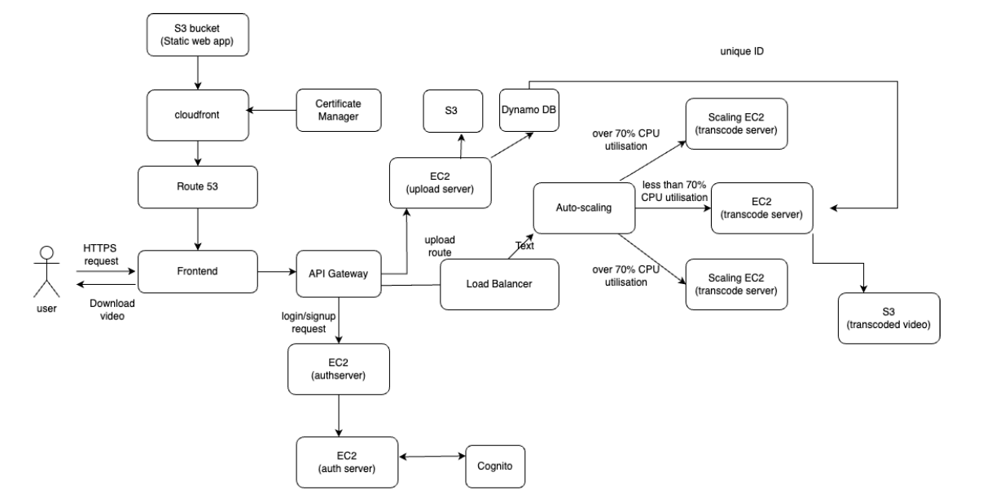

# 🎬 Cloud Video Platform

A secure, scalable, and efficient cloud-based platform built on **AWS**. It allows users to **upload**, **transcode**, and **download** videos. The system integrates video processing, user authentication, and metadata management through modern cloud-native architecture.

---

## 🛠️ Tech Stack

| Layer        | Technology             | Purpose                                           |
|--------------|------------------------|---------------------------------------------------|
| **Frontend** | React + S3 + CloudFront | Static hosting, secure CDN delivery               |
| **Auth**     | AWS Cognito + EC2      | User authentication with MFA support              |
| **Backend**  | EC2 + Express + API Gateway | Handles video upload, login/signup, and processing |
| **Storage**  | Amazon S3              | Stores uploaded and transcoded videos, static files |
| **Database** | DynamoDB               | Stores video metadata and user data               |
| **Processing** | EC2 (Auto-Scaled)     | Transcodes videos based on CPU usage              |
| **Scaling**  | Auto Scaling Group + Load Balancer | Manages scaling and traffic routing     |
| **Routing**  | Route 53               | DNS routing for frontend                          |
| **Security** | ACM + HTTPS + IAM      | SSL certificates, identity management             |

---

## 🧩 Architecture Overview

### Components

- **S3 Bucket**
  - Stores frontend files, uploaded videos, transcoded outputs
  - Generates pre-signed URLs for upload/download
- **CloudFront**
  - Delivers static frontend globally via CDN
- **Route 53**
  - Provides domain name system (DNS) routing to the app
- **API Gateway**
  - Central entry point for API requests (upload, login, transcode)
- **EC2 Instances**
  - **Upload Server**: Handles video uploads and metadata
  - **Auth Server**: Manages login/signup requests via Cognito
  - **Transcode Server**: Converts video formats; auto-scaled
- **Auto Scaling**
  - Adjusts the number of transcode EC2 instances based on CPU usage (>70%)
- **DynamoDB**
  - Stores video metadata and user records
- **Cognito**
  - Manages secure user authentication with MFA
- **Load Balancer**
  - Distributes traffic to upload/transcode servers efficiently

---

## ⚙️ Features

- 🔒 Secure authentication using AWS Cognito (with MFA)
- ☁️ Upload videos through pre-signed S3 URLs
- 🔁 Auto-scaled transcoding for efficient resource usage
- 📄 Metadata tracking using DynamoDB
- 🚀 Static front-end hosting via S3 and CloudFront
- ⬇️ Pre-signed download links for transcoded videos
- 📈 Intelligent scaling using EC2 + Load Balancer + CPU thresholds

---

